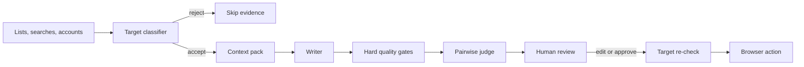
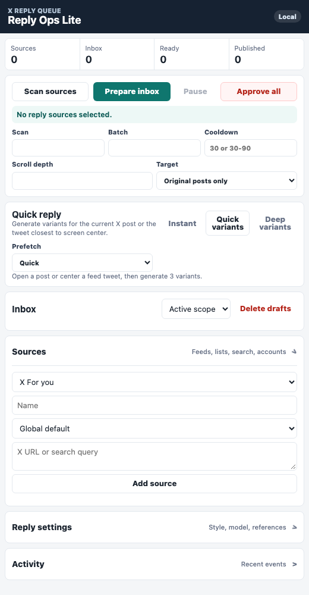
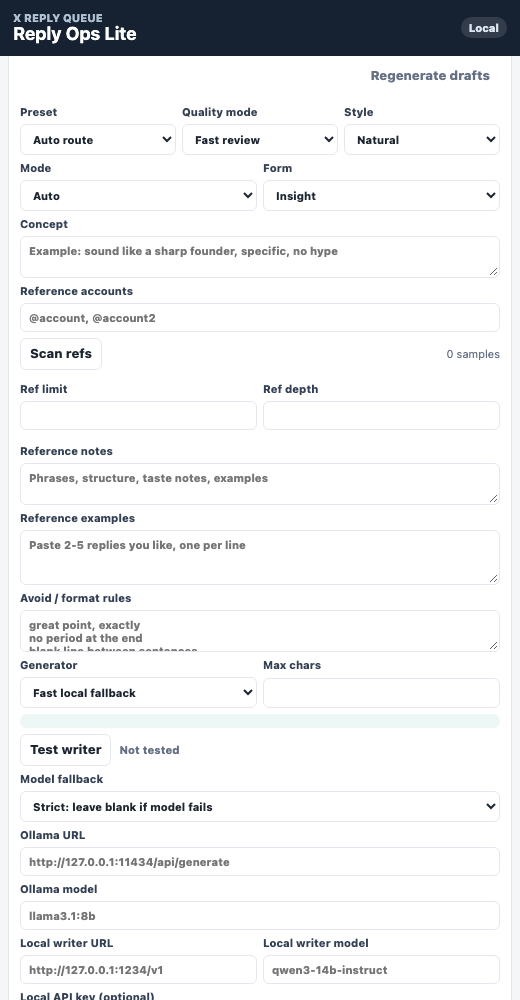
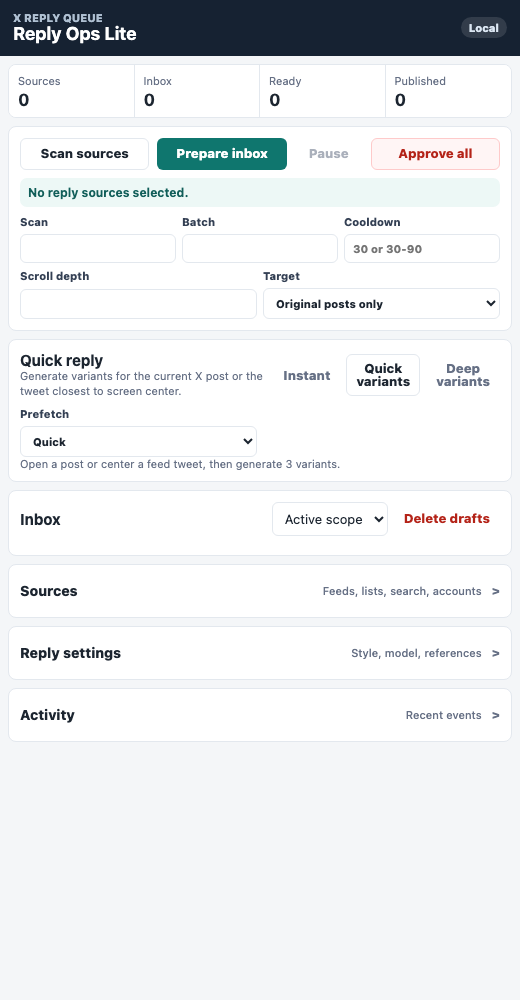

# Reply Ops

> A local-first AI workflow for researching, reviewing, and publishing context-aware replies from the browser.


Reply Ops treats social publishing as an operation with evidence and approval, not as a one-shot text prompt. It finds real posts from configured sources, rejects unsuitable targets, builds a complete context pack, generates distinct candidates, ranks them, and keeps the final public action under user control.

This repository is a product and engineering case study. The deployable extension, provider configuration, live selectors, credentials, and publishing controls remain private.

- **Status:** active private product
- **Runtime:** Chrome Manifest V3 side panel
- **Inference:** local Ollama or OpenAI-compatible endpoint
- **Execution:** the user's existing authenticated browser session
- **Verification:** 17 target, queue, lifecycle, and thread-resolution tests

## Product problem

The difficult part of a useful reply assistant is not producing another sentence. It is answering five questions reliably:

1. Is this the correct post and is it appropriate to answer?
2. Did the system understand the post, quotation, link card, image, and current discussion together?
3. Are the candidate replies meaningfully different and grounded in visible evidence?
4. Can an operator understand why one option was preferred?
5. Is the target still valid immediately before the browser publishes anything?

## Core workflow



Candidates pass through explicit states:

```text
new -> drafting -> ready -> publishing -> published
               \-> failed
               \-> rejected
```

Queue state is a domain contract rather than a visual side effect. Reloading the side panel does not make an uncertain action look complete.

## Product tour

### Source and scan control

Lists, searches, accounts, and the current feed can be configured as explicit sources. Batch size, cooldown, scroll depth, target type, and reply scope remain visible before collection begins.



### Style, quality, and model policy

The operator controls the reply preset, quality mode, style, form, references, avoided phrases, local model, fallback behavior, and output length. These settings are policy inputs rather than hidden prompt changes.



### One compact operating surface

Scan, preparation, review, quick reply, publishing, and recent activity stay in one side panel beside the page being evaluated.

<details>
<summary>View the complete Reply Ops side panel</summary>



</details>

## Product decisions

| Decision | Why it exists |
| --- | --- |
| Approval over autonomy | The model recommends; the user remains accountable for the public action. |
| One context pack | Text, images, quotations, and link cards describe one situation and should not be prompted independently. |
| Three strong candidates | A small, genuinely distinct choice set is more useful than twelve weak rewrites. |
| Separate writer and judge | Generation and selection have different failure modes. |
| Re-check before publish | Feed content and page state can change after generation. |
| Local-first inference | Social-account context and style history can stay on the user's machine. |
| Fail closed | A missing model result or uncertain target produces no public action. |

## Implementation boundaries

The production extension uses Manifest V3 and separates four responsibilities:

```text
side panel UI
    | commands and state projections
background operation queue
    | serialized text / vision work
target classifier + context builder
    | validated candidate contract
content script browser adapter
```

| Runtime boundary | Owns |
| --- | --- |
| Side panel | Operator intent, review state, edits, and approvals. |
| Background worker | Serialized model work, cancellation, deduplication, and durable queue transitions. |
| Target classifier | Eligibility, canonical identity, skip reasons, and duplicate prevention. |
| Context builder | Post, thread, quote, link card, media, OCR, and current-X evidence. |
| Writer | Distinct candidate generation within the active style and quality policy. |
| Pairwise judge | Independent comparison after hard quality gates. |
| Content script | Reading the live page, revalidating the target, inserting text, and publishing only after approval. |

### Request coordination

- Text and vision work share one background queue.
- Identical active requests share a result instead of competing for the local model.
- A new interactive request can cancel stale prefetch work.
- Quick generation uses a smaller context and output budget.
- Deep generation adds media analysis, current discussion, planning, and reference memory.

### Context pipeline

1. Canonicalize the visible X status URL.
2. Resolve the focal post and its thread root.
3. Classify the target before spending model time.
4. Merge post text, quote, card, media, OCR, and current discussion into one context pack.
5. Generate a deliberately small set of structurally different candidates.
6. Reject weak candidates through deterministic quality gates.
7. Compare survivors with an independent pairwise judge.
8. Expose the preferred option and its evidence to the operator.
9. Revalidate the live target immediately before insertion or publication.

This order matters: expensive generation begins only after target eligibility is known, and browser execution happens only after the target is checked again.

### Target integrity

The same validation boundary is used by batch preparation, quick reply, regeneration, and approval:

```ts
type TargetDecision =
  | { ok: true; canonicalUrl: string; kind: "post" | "reply" }
  | {
      ok: false;
      reason:
        | "promotion"
        | "duplicate"
        | "own-post"
        | "reply-disabled"
        | "page-unverified";
    };
```

This is a representative public contract, not the deployable classifier.

## Quality model

Before an option is shown as ready, the system checks:

- relevance to the actual claim;
- required image or OCR anchors;
- duplicate and paraphrase similarity;
- formatting and avoided phrases;
- unsupported claims;
- length and tone constraints;
- whether the response adds something instead of restating the post.

Operator feedback such as `too generic`, `missed image`, `too AI`, and `too long` influences later ranking without pretending to be model training.

## Failure model

| Failure | Product behavior |
| --- | --- |
| Target is an ad, repost, duplicate, or own post | Skip with an explicit reason before generation. |
| Reply target cannot be resolved | Fail closed; no candidate is publishable. |
| Local model is unavailable | Follow the selected fallback policy: strict blank, review-only fallback, or rules fallback. |
| Vision context is required but missing | Block or penalize the candidate according to the active quality mode. |
| Prefetch becomes stale | Cancel it when a newer interactive request has priority. |
| Publish is interrupted | Preserve an uncertain state instead of reporting success. |
| Page changed after review | Re-check the canonical target and block mismatched execution. |
| Candidate text is empty | Approve and publish remains unavailable. |

The product never converts missing evidence into a successful state.

## UI rationale

1. **Review stays beside context.** The side panel keeps the original page visible while options are evaluated.
2. **Three options, not a prompt dump.** A small choice set encourages comparison instead of endless regeneration.
3. **Reasons remain visible.** Skip summaries, context reads, and judge results make model behavior inspectable.
4. **Quick and deep work are separate.** Browsing does not need the same latency or context budget as a prepared campaign.
5. **Publishing is visually distinct.** Generation, insertion, approval, and final submission are different actions.

## Verification evidence

The private product currently passes 17 automated contract tests covering:

- manifest loading and shared selector ownership;
- normal draft and publish lifecycle;
- interrupted-publish recovery;
- prevention of illegal state regression;
- canonical X and Twitter URL identity;
- ads, reposts, replies, duplicates, and own-post rejection;
- media-only and incomplete target handling;
- thread-root resolution around ads and reposts.

Static syntax checks also cover the classifier, queue, selector registry, thread resolver, content script, background worker, and side panel runtime.

## Privacy and authority

- Starts with empty local storage.
- Sources are configured by the user.
- Candidates come from real pages, never demo records.
- Local models are supported through Ollama or an OpenAI-compatible endpoint.
- A failed target check prevents publishing.
- Quick Insert fills the composer but does not submit it.
- Production credentials and selector details are not part of this repository.

## SaaS direction

The product can grow into a team SaaS while keeping publishing authority in the browser:

- shared style and policy profiles;
- role-based approval queues;
- source ownership and assignment;
- usage metering and Stripe billing;
- outcome analytics;
- reusable brand memory;
- audit history across operators.

The hosted layer would coordinate people and policy. The extension would remain the trusted execution boundary.

## Public scope

Included here:

- real product screenshot;
- product workflow;
- architecture and safety boundaries;
- representative type contracts;
- design rationale.

Not included:

- deployable extension source;
- active selectors and anti-duplication fingerprints;
- prompts and ranking weights;
- credentials or provider configuration;
- automated publishing implementation.

---

Built by [0xENTYPER](https://github.com/0xENTYPER).
