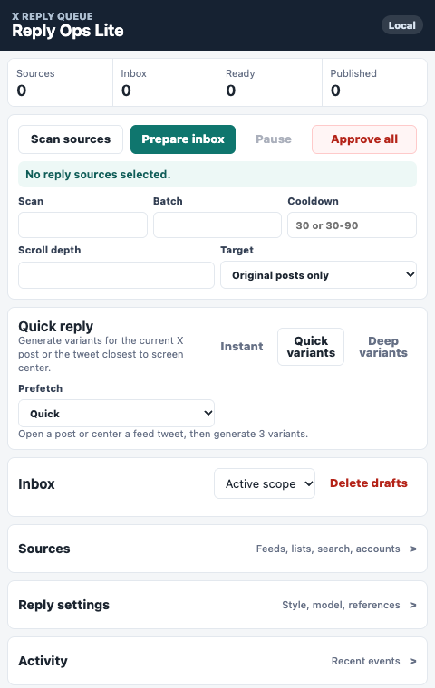
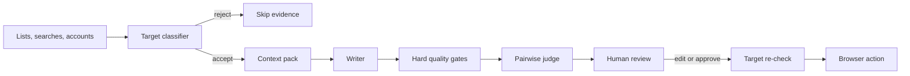

# Reply Ops

> A local-first AI workflow for researching, reviewing, and publishing context-aware replies from the browser.



Reply Ops treats social publishing as an operation with evidence and approval, not as a one-shot text prompt. It finds real posts from configured sources, rejects unsuitable targets, builds a complete context pack, generates distinct candidates, ranks them, and keeps the final public action under user control.

This repository is a product and engineering case study. The deployable extension, provider configuration, live selectors, credentials, and publishing controls remain private.

## Product problem

The difficult part of a useful reply assistant is not producing another sentence. It is answering five questions reliably:

1. Is this the correct post and is it appropriate to answer?
2. Did the system understand the post, quotation, link card, image, and current discussion together?
3. Are the candidate replies meaningfully different and grounded in visible evidence?
4. Can an operator understand why one option was preferred?
5. Is the target still valid immediately before the browser publishes anything?

## Core workflow



Candidates pass through explicit states:

```text
new -> drafting -> ready -> publishing -> published
               \-> failed
               \-> rejected
```

Queue state is a domain contract rather than a visual side effect. Reloading the side panel does not make an uncertain action look complete.

## Product decisions

| Decision | Why it exists |
| --- | --- |
| Approval over autonomy | The model recommends; the user remains accountable for the public action. |
| One context pack | Text, images, quotations, and link cards describe one situation and should not be prompted independently. |
| Three strong candidates | A small, genuinely distinct choice set is more useful than twelve weak rewrites. |
| Separate writer and judge | Generation and selection have different failure modes. |
| Re-check before publish | Feed content and page state can change after generation. |
| Local-first inference | Social-account context and style history can stay on the user's machine. |
| Fail closed | A missing model result or uncertain target produces no public action. |

## Implementation boundaries

The production extension uses Manifest V3 and separates four responsibilities:

```text
side panel UI
    | commands and state projections
background operation queue
    | serialized text / vision work
target classifier + context builder
    | validated candidate contract
content script browser adapter
```

### Request coordination

- Text and vision work share one background queue.
- Identical active requests share a result instead of competing for the local model.
- A new interactive request can cancel stale prefetch work.
- Quick generation uses a smaller context and output budget.
- Deep generation adds media analysis, current discussion, planning, and reference memory.

### Target integrity

The same validation boundary is used by batch preparation, quick reply, regeneration, and approval:

```ts
type TargetDecision =
  | { ok: true; canonicalUrl: string; kind: "post" | "reply" }
  | {
      ok: false;
      reason:
        | "promotion"
        | "duplicate"
        | "own-post"
        | "reply-disabled"
        | "page-unverified";
    };
```

This is a representative public contract, not the deployable classifier.

## Quality model

Before an option is shown as ready, the system checks:

- relevance to the actual claim;
- required image or OCR anchors;
- duplicate and paraphrase similarity;
- formatting and avoided phrases;
- unsupported claims;
- length and tone constraints;
- whether the response adds something instead of restating the post.

Operator feedback such as `too generic`, `missed image`, `too AI`, and `too long` influences later ranking without pretending to be model training.

## Privacy and authority

- Starts with empty local storage.
- Sources are configured by the user.
- Candidates come from real pages, never demo records.
- Local models are supported through Ollama or an OpenAI-compatible endpoint.
- A failed target check prevents publishing.
- Quick Insert fills the composer but does not submit it.
- Production credentials and selector details are not part of this repository.

## SaaS direction

The product can grow into a team SaaS while keeping publishing authority in the browser:

- shared style and policy profiles;
- role-based approval queues;
- source ownership and assignment;
- usage metering and Stripe billing;
- outcome analytics;
- reusable brand memory;
- audit history across operators.

The hosted layer would coordinate people and policy. The extension would remain the trusted execution boundary.

## Public scope

Included here:

- real product screenshot;
- product workflow;
- architecture and safety boundaries;
- representative type contracts;
- design rationale.

Not included:

- deployable extension source;
- active selectors and anti-duplication fingerprints;
- prompts and ranking weights;
- credentials or provider configuration;
- automated publishing implementation.

---

Built by [0xENTYPER](https://github.com/0xENTYPER).
